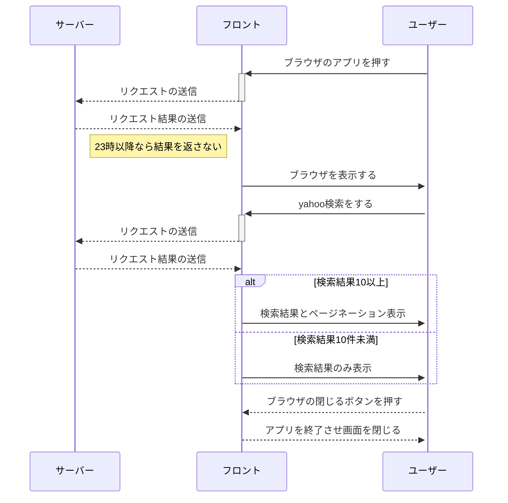

# マーメイドのテスト

```mermaid
sequenceDiagram
    participant server as サーバー
    participant front as フロント
    participant user as ユーザー

    user ->>+ front: ブラウザのアプリを押す
    front -->>- server: リクエストの送信
    server -->> front: リクエスト結果の送信
    Note right of server: 23時以降なら結果を返さない

    front ->>+ user: ブラウザを表示する
    user ->>+ front: yahoo検索をする
    
    front -->>- server: リクエストの送信
    server -->> front: リクエスト結果の送信

    alt 検索結果10以上
        front ->> user: 検索結果とページネーション表示
    else 検索結果10件未満
        front ->> user: 検索結果のみ表示 
    end

    user -->> front: ブラウザの閉じるボタンを押す
    front -->> user: アプリを終了させ画面を閉じる
    
```
